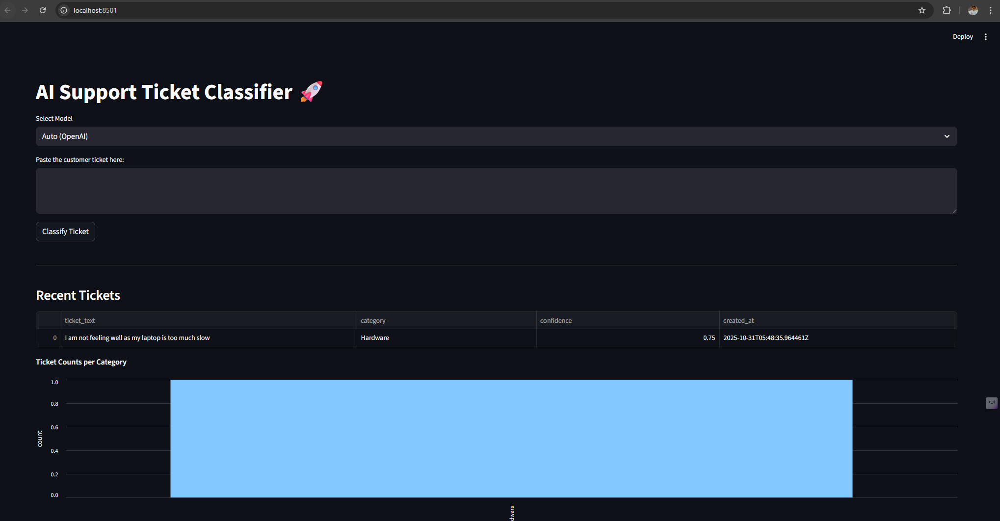

# ai-support-ticket-classifier
A Streamlit app where users paste a customer complaint, and it auto-tags the issue type (e.g. "Network", "Billing", "Hardware") using a generative model.

# Cloud Formation Deployment using CLI
Cloud Formation Template file is present in CloudFormation folder.
## 🚀 How to Deploy

### Upload your Lambda ZIP to an existing S3 bucket:

$ aws s3 cp <lambda_function_dev_package>.zip \
s3://<your-bucket-name>/<bucket_path>/<lambda_function_dev_package>.zip


### Deploy the stack:

$ aws cloudformation create-stack \
  --stack-name ai-ticket-classifier \
  --template-body file://cloudformation.yaml \
  --capabilities CAPABILITY_IAM \
  --parameters \
    ParameterKey=LambdaS3Bucket,ParameterValue=<your-bucket-name> \
    ParameterKey=LambdaS3Key,ParameterValue=<bucket_path>/<lambda_function_dev_package>.zip \
    ParameterKey=OpenAIApiKeyParameter,ParameterValue=```<sk-your-api-key>```

Once complete, grab the API URL from Outputs → ApiUrl.

# Terraform Deployment
All terraform script are present in terraform folder. You will need to install Terraform application/binary on you machine.
## How to Deploy
### Deploy steps

#### 1. Initialize Terraform

$ terraform init

#### 2. Validate and plan

$ terraform plan -out=tfplan

#### 3. Apply changes

$ terraform apply tfplan

#### 4. Destroy later if needed

$ terraform destroy

# Testing Application using curl

## Get Classification for give Ticket Text
$ curl -X POST "`<API Url>`/classify" -H "Content-Type: application/json" \
-d "{""ticket_text"": ""<Ticket text>"", ""model"": ""<bedrock/openai>""}" \
--ssl-no-revoke

#### Example
$ curl -X POST "https://j2ixyuzc1a.execute-api.ap-south-1.amazonaws.com/prod/classify" \
-H "Content-Type: application/json" \
-d "{""ticket_text"": ""Windows Machine restarted continuously"", ""model"": ""bedrock""}" \
--ssl-no-revoke

### Get all the Ticket Classification 
$ curl -X GET "`<API Url>`/tickets" \
-H "Content-Type: application/json" --ssl-no-revoke

#### Example
curl -X GET "https://2pymg5lsn7.execute-api.ap-south-1.amazonaws.com/prod" \
--ssl-no-revoke 


# Testing Application using Streamlit UI
#### Configure API URL
Set APIURl(you got after deploying resource using CloudFormation or Terraform) in .streamlit/secrets.toml
API_URL="https://3d5h7xh2hc.execute-api.ap-south-1.amazonaws.com/prod"

#### Run stream lit application
streamlit run streamlit_app.py

This will open Browser with UI:
